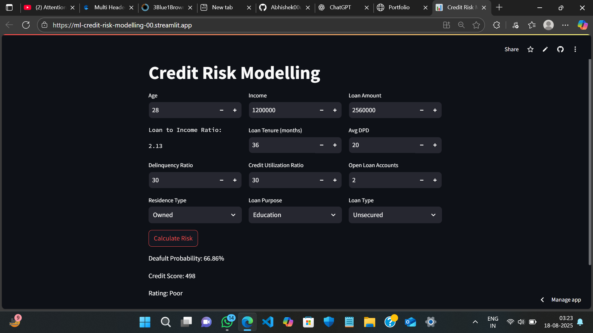

# 🏦 Credit Risk Scoring System (Like CIBIL) — Streamlit App

This project is a custom-built credit risk scoring system that predicts the likelihood of loan default and assigns a credit score and rating to users. Inspired by how credit bureaus like **CIBIL** operate, it uses machine learning models trained on real-world financial behavior and is deployed as an interactive **Streamlit web application**.

---

## 🚀 Demo

🎯 **Try the live app:** [Streamlit Link](#) *(https://ml-credit-risk-modelling-00.streamlit.app/)*  

---

## 📊 Problem Statement

In lending, it's crucial to identify the **creditworthiness** of applicants before issuing loans. This app helps simulate a credit bureau by:
- Taking in financial & behavioral attributes.
- Predicting **default probability**.
- Assigning a **credit score (0–900)**.
- Categorizing the user into **Poor, Average, Good, or Excellent**.

---

## 🧠 Features & Workflow

### 🔹 User Inputs
- Age, Income, Loan Amount, Loan Tenure
- Average DPD, Delinquency Ratio
- Credit Utilization Ratio, Open Loan Accounts
- Categorical: Loan Type, Residence Type, Loan Purpose

> 💡 Derived Feature: **Loan-to-Income Ratio**

### 🔹 Model & Pipeline
- Final Model: **Logistic Regression**
- Tuning: **Optuna** for hyperparameter optimization
- Tried: Random Forest, XGBoost
- Class Imbalance: **SMOTE-Tomek**

### 🔹 Model Evaluation
- **ROC AUC**
- **KS-Statistic**
- **Gini Coefficient**
- **Rank Ordering**

### 🔹 Output
- Default Probability (%)
- Credit Score (0–900)
- Risk Category (Poor, Average, Good, Excellent)

---

## 🖥️ App Preview

 <!-- Add your screenshot image -->

---

## ⚙️ Tech Stack

| Layer        | Tool/Library              |
|--------------|---------------------------|
| Frontend     | Streamlit                 |
| Backend      | Scikit-learn, Optuna      |
| Data Prep    | Pandas, NumPy             |
| Imbalance    | imblearn (SMOTE-Tomek)    |
| Evaluation   | sklearn.metrics           |
| Deployment   | Streamlit Cloud / Local   |

---

